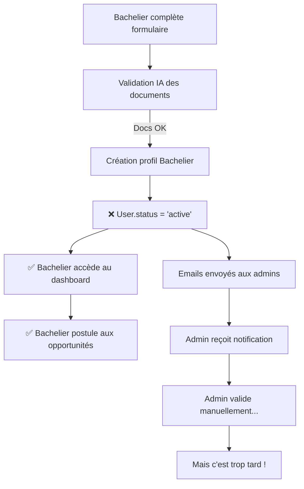
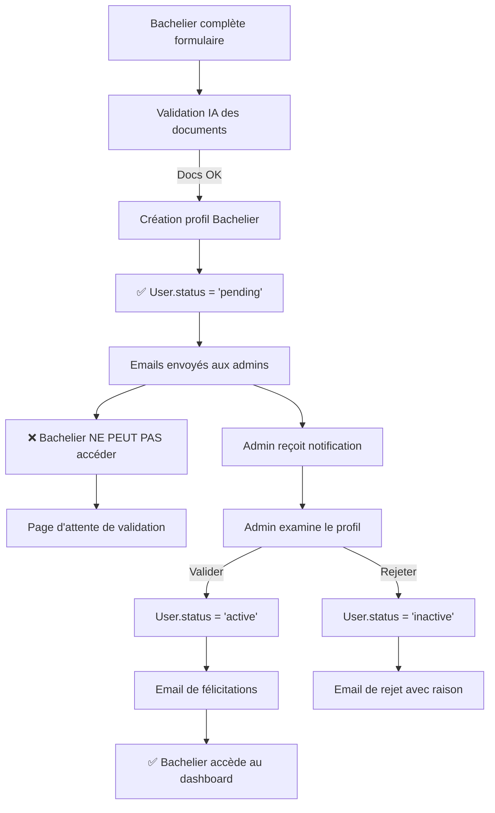

# 🔍 AUDIT : Flux de Validation Admin Manquant

## ❌ PROBLÈME IDENTIFIÉ

**Le bachelier accède immédiatement à la plateforme SANS validation admin préalable**

### 📊 Analyse des Logs

```log
[14:44:36] Job d'extraction IA dispatché après création de profil social
[14:44:36] Notifications email envoyées (13 admins notifiés)
[14:45:01] CandidatureController@store called  ← LE BACHELIER POSTULE DÉJÀ !
[14:45:01] Candidature created successfully
```

**Intervalle** : **25 secondes** entre la création du profil et la première candidature !

Le bachelier peut immédiatement :
- ✅ Accéder au dashboard
- ✅ Voir les opportunités
- ✅ Postuler aux bourses
- ✅ Accéder à toutes les fonctionnalités

**SANS** qu'un admin ait validé son profil ou ses documents.

---

## 🔍 CAUSE RACINE

### Code Problématique : `SocialAuthService::createBachelierProfile()`

```php
// Ligne 119-164
$bachelier = Bachelier::create([
    'user_id' => $user->id,
    ...
    'status_candidature' => 'en_attente',  // ✅ Correct
    'status_profil' => 'complet',
]);

// Ligne 167 - ❌ PROBLÈME ICI !
$user->update(['status' => 'active']); // Active immédiatement le compte

// Ligne 201-210
Mail::to($bachelier->email_eleve)->send(...); // Email bachelier
Mail::to($admin->email)->send(...); // Email admins
```

**Le problème** : Le compte User passe à `status = 'active'` immédiatement après la création du profil Bachelier, AVANT toute validation admin.

---

## 🎯 FLUX ACTUEL (INCORRECT)



**Problèmes** :
1. ❌ Pas de contrôle qualité des candidatures
2. ❌ Admin ne peut pas rejeter avant accès
3. ❌ Documents invalides peuvent passer
4. ❌ Possibilité de fausses candidatures
5. ❌ Spam de candidatures non vérifiées

---

## ✅ FLUX ATTENDU (CORRECT)



**Avantages** :
1. ✅ Contrôle qualité des candidatures
2. ✅ Admin peut rejeter avant accès
3. ✅ Documents vérifiés humainement
4. ✅ Pas de fausses candidatures
5. ✅ Base de données propre

---

## 🔧 CORRECTIONS NÉCESSAIRES

### 1. **SocialAuthService.php** - Ligne 167

**AVANT** :
```php
// Activer le compte maintenant que le profil est complet
$user->update(['status' => 'active']);
```

**APRÈS** :
```php
// Garder le compte en 'pending' en attente de validation admin
// Le status passera à 'active' quand l'admin validera
$user->update(['status' => 'pending']); // Pas de changement de status
```

Ou simplement **SUPPRIMER** cette ligne car le user est déjà en 'pending' depuis sa création.

---

### 2. **Middleware de Vérification** - Nouveau fichier

Créer `app/Http/Middleware/EnsureUserIsActive.php` :

```php
<?php

namespace App\Http\Middleware;

use Closure;
use Illuminate\Http\Request;
use Illuminate\Support\Facades\Auth;

class EnsureUserIsActive
{
    public function handle(Request $request, Closure $next)
    {
        $user = Auth::user();
        
        if (!$user) {
            return redirect()->route('login');
        }
        
        // Si l'utilisateur est pending, rediriger vers page d'attente
        if ($user->status === 'pending') {
            // Vérifier s'il a un profil bachelier complet
            if ($user->role === 'bachelier' && $user->bachelier) {
                return redirect()->route('auth.pending-validation');
            }
            
            // Sinon, compléter le profil
            return redirect()->route('auth.complete-profile');
        }
        
        // Si l'utilisateur est suspendu/banni/inactif
        if (in_array($user->status, ['suspended', 'banned', 'inactive'])) {
            Auth::logout();
            return redirect()->route('login')
                ->with('error', 'Votre compte a été ' . $user->status . '. Contactez l\'administration.');
        }
        
        // Status 'active' : laisser passer
        return $next($request);
    }
}
```

---

### 3. **Enregistrer le Middleware** - `bootstrap/app.php`

```php
->withMiddleware(function (Middleware $middleware) {
    $middleware->alias([
        'active' => \App\Http\Middleware\EnsureUserIsActive::class,
    ]);
})
```

---

### 4. **Appliquer le Middleware** - `routes/web.php`

```php
// TOUTES les routes bacheliers doivent vérifier que le user est 'active'
Route::middleware(['auth', 'active'])->group(function () {
    
    // Dashboard
    Route::get('/bachelier/dashboard', [BachelierController::class, 'dashboard'])
        ->name('bachelier.dashboard');
    
    // Opportunités
    Route::get('/bachelier/opportunites', [OpportuniteController::class, 'index'])
        ->name('bachelier.opportunites.index');
    
    // Candidatures
    Route::post('/bachelier/candidatures', [CandidatureController::class, 'store'])
        ->name('bachelier.candidatures.store');
    
    // Profil
    Route::get('/bachelier/profile', [ProfileController::class, 'show'])
        ->name('bachelier.profile');
    
    // ... toutes les autres routes bacheliers
});
```

---

### 5. **Page d'Attente** - Nouvelle vue

Créer `resources/views/auth/pending-validation.blade.php` :

```blade
<x-guest-layout>
    <div class="min-h-screen flex items-center justify-center bg-gradient-to-br from-cyan-50 to-blue-100">
        <div class="max-w-2xl mx-auto p-8">
            <!-- Icône de sablier -->
            <div class="text-center mb-8">
                <div class="inline-flex items-center justify-center w-24 h-24 bg-gradient-to-br from-[#0E7490] to-[#0c5f7a] rounded-full mb-6">
                    <svg class="w-12 h-12 text-white" fill="none" stroke="currentColor" viewBox="0 0 24 24">
                        <path stroke-linecap="round" stroke-linejoin="round" stroke-width="2" d="M12 8v4l3 3m6-3a9 9 0 11-18 0 9 9 0 0118 0z"/>
                    </svg>
                </div>
                <h1 class="text-3xl font-bold text-gray-900 mb-4">
                    Votre candidature est en cours d'examen
                </h1>
                <p class="text-lg text-gray-600">
                    Merci d'avoir complété votre profil PEUB !
                </p>
            </div>
            
            <!-- Message principal -->
            <div class="bg-white rounded-2xl shadow-xl p-8 mb-6">
                <div class="flex items-start mb-6">
                    <div class="flex-shrink-0">
                        <svg class="w-8 h-8 text-[#0E7490]" fill="none" stroke="currentColor" viewBox="0 0 24 24">
                            <path stroke-linecap="round" stroke-linejoin="round" stroke-width="2" d="M13 16h-1v-4h-1m1-4h.01M21 12a9 9 0 11-18 0 9 9 0 0118 0z"/>
                        </svg>
                    </div>
                    <div class="ml-4">
                        <h3 class="text-xl font-semibold text-gray-900 mb-2">
                            Que se passe-t-il maintenant ?
                        </h3>
                        <p class="text-gray-600 leading-relaxed">
                            Votre profil et vos documents sont actuellement examinés par notre équipe d'administration. 
                            Ce processus nous permet de garantir la qualité et l'authenticité de toutes les candidatures PEUB.
                        </p>
                    </div>
                </div>
                
                <!-- Timeline -->
                <div class="space-y-6 mt-8">
                    <div class="flex items-start">
                        <div class="flex-shrink-0">
                            <div class="w-10 h-10 bg-green-100 rounded-full flex items-center justify-center">
                                <svg class="w-6 h-6 text-green-600" fill="none" stroke="currentColor" viewBox="0 0 24 24">
                                    <path stroke-linecap="round" stroke-linejoin="round" stroke-width="2" d="M5 13l4 4L19 7"/>
                                </svg>
                            </div>
                        </div>
                        <div class="ml-4">
                            <p class="font-semibold text-gray-900">✅ Profil complété</p>
                            <p class="text-sm text-gray-600">Vos informations ont été soumises avec succès</p>
                        </div>
                    </div>
                    
                    <div class="flex items-start">
                        <div class="flex-shrink-0">
                            <div class="w-10 h-10 bg-blue-100 rounded-full flex items-center justify-center animate-pulse">
                                <svg class="w-6 h-6 text-blue-600" fill="none" stroke="currentColor" viewBox="0 0 24 24">
                                    <path stroke-linecap="round" stroke-linejoin="round" stroke-width="2" d="M12 8v4l3 3m6-3a9 9 0 11-18 0 9 9 0 0118 0z"/>
                                </svg>
                            </div>
                        </div>
                        <div class="ml-4">
                            <p class="font-semibold text-gray-900">🔄 En cours d'examen</p>
                            <p class="text-sm text-gray-600">Notre équipe vérifie vos documents et informations</p>
                        </div>
                    </div>
                    
                    <div class="flex items-start opacity-50">
                        <div class="flex-shrink-0">
                            <div class="w-10 h-10 bg-gray-100 rounded-full flex items-center justify-center">
                                <svg class="w-6 h-6 text-gray-400" fill="none" stroke="currentColor" viewBox="0 0 24 24">
                                    <path stroke-linecap="round" stroke-linejoin="round" stroke-width="2" d="M9 12l2 2 4-4m6 2a9 9 0 11-18 0 9 9 0 0118 0z"/>
                                </svg>
                            </div>
                        </div>
                        <div class="ml-4">
                            <p class="font-semibold text-gray-900">⏳ Validation finale</p>
                            <p class="text-sm text-gray-600">Vous recevrez un email dès que votre compte sera activé</p>
                        </div>
                    </div>
                </div>
            </div>
            
            <!-- Délai estimé -->
            <div class="bg-yellow-50 border-l-4 border-yellow-400 p-6 rounded-lg mb-6">
                <div class="flex">
                    <div class="flex-shrink-0">
                        <svg class="w-6 h-6 text-yellow-400" fill="none" stroke="currentColor" viewBox="0 0 24 24">
                            <path stroke-linecap="round" stroke-linejoin="round" stroke-width="2" d="M12 8v4l3 3m6-3a9 9 0 11-18 0 9 9 0 0118 0z"/>
                        </svg>
                    </div>
                    <div class="ml-3">
                        <p class="text-sm text-yellow-700">
                            <strong>Délai estimé :</strong> 24 à 48 heures ouvrées.<br>
                            Vous recevrez un email de confirmation dès que votre profil sera validé.
                        </p>
                    </div>
                </div>
            </div>
            
            <!-- Actions -->
            <div class="text-center">
                <p class="text-gray-600 mb-4">
                    Des questions ? Contactez-nous :
                </p>
                <div class="flex justify-center space-x-6">
                    <a href="mailto:contact@ansut-peub.ci" class="text-[#0E7490] hover:underline font-semibold">
                        📧 contact@ansut-peub.ci
                    </a>
                    <a href="tel:+2250123456789" class="text-[#0E7490] hover:underline font-semibold">
                        📞 +225 01 23 45 67 89
                    </a>
                </div>
                
                <button onclick="window.location.reload()" 
                        class="mt-6 px-6 py-3 bg-gradient-to-r from-[#0E7490] to-[#0c5f7a] text-white font-semibold rounded-lg hover:shadow-lg transition">
                    Actualiser la page
                </button>
            </div>
        </div>
    </div>
</x-guest-layout>
```

---

### 6. **Route pour la Page d'Attente** - `routes/web.php`

```php
// Route accessible même si user est 'pending'
Route::get('/auth/pending-validation', function () {
    $user = Auth::user();
    
    // Si l'utilisateur est déjà actif, rediriger vers dashboard
    if ($user && $user->status === 'active') {
        return redirect()->route('bachelier.dashboard');
    }
    
    return view('auth.pending-validation');
})->middleware('auth')->name('auth.pending-validation');
```

---

## 📊 COMPARAISON

| Aspect | Flux Actuel ❌ | Flux Corrigé ✅ |
|--------|----------------|-----------------|
| **Statut après inscription** | `active` | `pending` |
| **Accès immédiat** | ✅ Oui | ❌ Non |
| **Validation admin** | Optionnelle | Obligatoire |
| **Contrôle qualité** | ❌ Aucun | ✅ Total |
| **Sécurité** | Faible | Élevée |
| **Expérience admin** | Passif | Actif |
| **Expérience bachelier** | Immédiate | Attente 24-48h |

---

## ✅ AVANTAGES DE LA CORRECTION

### Pour les Admins
1. ✅ **Contrôle total** sur qui accède à la plateforme
2. ✅ **Filtrage** des candidatures douteuses
3. ✅ **Vérification manuelle** des documents sensibles
4. ✅ **Statistiques propres** (pas de faux comptes)
5. ✅ **Workflow clair** : examiner → valider/rejeter

### Pour le Système
1. ✅ **Base de données propre** (pas de comptes spam)
2. ✅ **Qualité des candidatures** garantie
3. ✅ **Sécurité renforcée**
4. ✅ **Conformité légale** (KYC)
5. ✅ **Traçabilité complète**

### Pour les Bacheliers
1. ✅ **Transparence** du processus
2. ✅ **Feedback** sur le statut (en attente, validé, rejeté)
3. ✅ **Emails** de notification à chaque étape
4. ✅ **Crédibilité** de la plateforme

---

## 🚀 PLAN DE DÉPLOIEMENT

### Phase 1 : Correction du code (1h)
1. Modifier `SocialAuthService.php` (ligne 167)
2. Créer `EnsureUserIsActive` middleware
3. Créer vue `pending-validation.blade.php`
4. Créer route `auth.pending-validation`
5. Appliquer middleware aux routes bacheliers

### Phase 2 : Migration des comptes existants (30min)
```sql
-- Passer tous les bacheliers 'active' sans validation en 'pending'
UPDATE users 
SET status = 'pending' 
WHERE role = 'bachelier' 
  AND status = 'active'
  AND id IN (
      SELECT user_id FROM bacheliers 
      WHERE status_profil = 'complet' 
      AND date_verification IS NULL
  );
```

### Phase 3 : Test (1h)
1. Tester inscription complète d'un bachelier
2. Vérifier redirection vers page d'attente
3. Tester validation admin
4. Vérifier accès après validation
5. Tester rejet admin

### Phase 4 : Documentation (30min)
1. Documenter le nouveau flux
2. Former les admins
3. Mettre à jour le FAQ

---

## 📝 RÉSUMÉ

**Problème** : Les bacheliers accèdent immédiatement à la plateforme sans validation admin.

**Solution** :
1. Garder `User.status = 'pending'` après inscription
2. Créer middleware `EnsureUserIsActive`
3. Créer page d'attente `pending-validation`
4. Admin valide manuellement → `status = 'active'`

**Résultat** : Contrôle qualité total avant accès à la plateforme.

